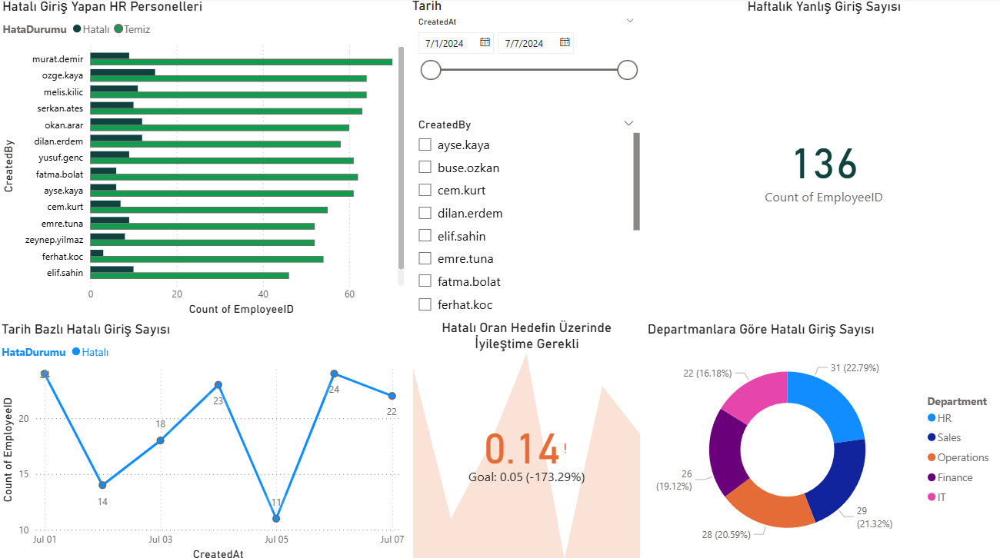

# HR Income Entry Control Dashboard 📊

This project analyzes salary input errors entered by HR teams, with a focus on identifying anomalies in the income records of employees working in the tourism and hospitality industry.

## 🧠 Project Goal

To identify and visualize incorrect income entries based on job titles, departments, and expected salary ranges using a dashboard built in Power BI.

## 🛠 Tools & Technologies
- Power BI (visualizations, DAX calculations, data modeling)
- Mockaroo (synthetic data generation)
- Excel (initial data exploration)

## 📁 Data Description

The dataset was generated using [Mockaroo.com](https://mockaroo.com/) and includes:
- EmployeeID	
- MonthlyIncome
- Department
- CreatedBy
- CreatedAt
  
Total Records: **1000**

## 📷 Dashboard Preview

## 📈 Dashboard Features

- 🔍 Salary anomaly detection using conditional formatting
- 📂 Breakdown of incorrect entries by department and role
- 📊 Interactive filters for detailed drill-down
- 🚨 Visual alerts for entries that fall outside expected income ranges

## 🚀 How to Use

1. Clone the repository.
2. Open the `.pbix` file using Power BI Desktop.
3. Explore the dashboard interactively or edit it for further customization.

## 🧑‍💻 Author

Created by Ersin Tepegöz

---

📝 All data is synthetic.
